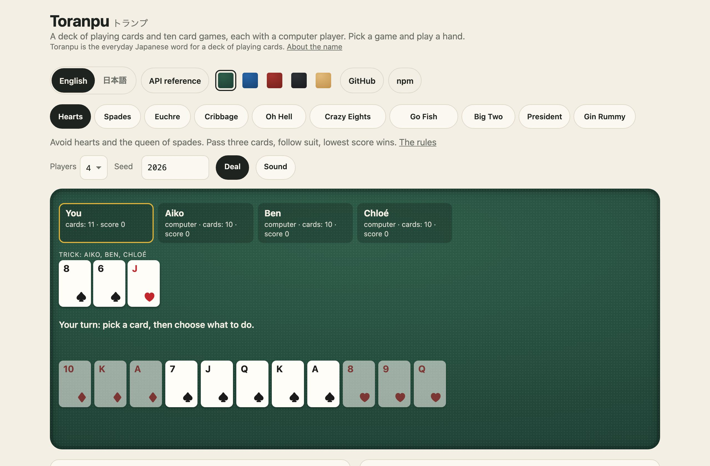
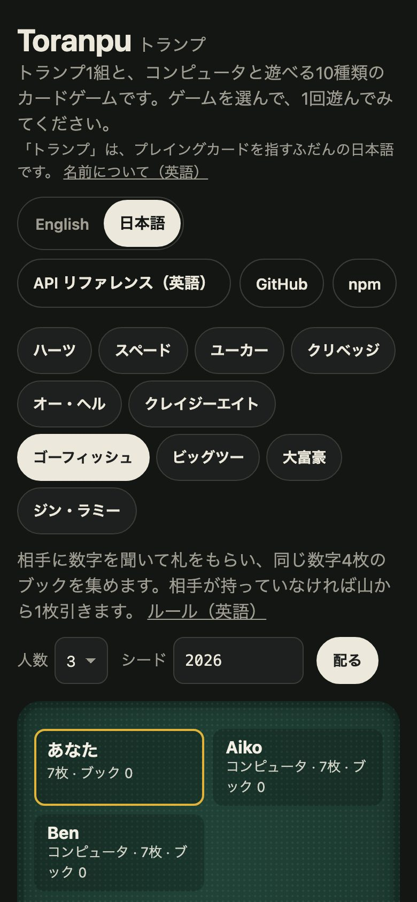

<h1 align="center">Toranpu <sub>トランプ</sub></h1>

<p align="center"><strong>A deck of playing cards and ten card games, each with a computer player.</strong><br>
Hearts, Spades, Euchre, Cribbage, Oh Hell, Crazy Eights, Go Fish, Big Two, President and Gin Rummy: the rules as pure functions, seeded deals, saved games, and a table that runs anywhere.</p>

<p align="center">
  <a href="https://github.com/johnmorrisdotca/toranpu/actions/workflows/ci.yml"></a>
  <a href="https://www.npmjs.com/package/@johnmorrisdotca/toranpu"></a>
  <a href="./LICENSE"></a>
  
  
</p>

<p align="center"><a href="https://johnmorrisdotca.github.io/toranpu/"><strong>Play a hand against the computer →</strong></a></p>

<p align="center">
  
  
</p>

A playing card library and a card game engine for JavaScript and TypeScript:
a standard 52-card deck with a seeded shuffle, and the full rules of ten
classic card games, each with a computer opponent (a bot) for every seat.

- **What is different.** The games are complete, down to the rules a table
  argues about, and every one answers the same few questions, so one table
  plays all ten. The computers see only what their seat could see. A game is
  its seed and its moves, so it can be saved, shared, replayed and checked.
- **What it costs a project.** Nothing: no dependencies, and one import. One
  game on its own is about 8 kB.

## In 30 seconds

```sh
npm install @johnmorrisdotca/toranpu    # or pnpm add, or yarn add
```

```ts
import { moveText, newGame, playComputers, rulesFor } from "@johnmorrisdotca/toranpu";

const players = ["You", "Aiko", "Ben"];
const rules = rulesFor("goFish");
let game = newGame("goFish", { players, seed: 2026, computers: [false, true, true] })!;

game = playComputers("goFish", game).game;        // the computers move until it is your turn
const offered = rules.moves(game);                // every move you may make: 12 of them
moveText("goFish", offered[0], { players });      // "Ask Aiko for fours"
game = rules.play(game, offered[0])!;             // the game after your move; the old one is untouched
```

And from a terminal, on Linux, macOS or Windows:

```sh
npx @johnmorrisdotca/toranpu deal --hands 2 --each 5 --seed 42   # Seat 1: 3♣ 2♥ K♣ 7♠ 10♦ …
```

Or with nothing to install, [play a hand in the demo](https://johnmorrisdotca.github.io/toranpu/).

## Who it is for

- **Anybody building a card table.** The rules, the deal, the turn order, the
  scoring and the computer players are done. You draw the cards.
- **Games sites and apps.** Ten games behind one interface, playable by
  people, computers or any mix, with saves that cannot be tampered with.
- **Bots and research.** Pure functions over plain data: play a million games
  in a loop, pit your own player against the ones here, replay any game from
  its seed.
- **A game of your own.** The deck by itself: fifty-two cards, a seeded
  shuffle, dealing, and codes short enough for a link.
- **Teaching.** Each game's rules are a few hundred lines you can read, with
  its tests beside them.

The games are traditional and in the public domain. Toranpu is not affiliated
with or endorsed by any publisher of an edition of them.

## Use it in your project

Toranpu is three things, each usable without the others: **the games**, as
plain functions over plain data; **the deck**, for a game of your own; and
**a React hook** that holds a game in state. It draws nothing: the table is
yours. The example below is the same small table each time, a game of Go
Fish against two computers with a button for every move you may make.

### 1. The API alone

```ts
import { CARD_GAME_TABLES, fromJSON, newGame, playComputers, rulesFor, toJSON, toText } from "@johnmorrisdotca/toranpu";

CARD_GAME_TABLES.euchre;      // { fewestPlayers: 4, mostPlayers: 4, defaultPlayers: 4, sizes: [5, 10], defaultSize: 10 }

const start = newGame("euchre", { players: ["North", "East", "South", "West"], seed: 42, computers: [true, true, true, true] })!;
const { game, moves } = playComputers("euchre", start);   // computers in every seat play it out
const rules = rulesFor("euchre");
rules.over(game);             // true
rules.winners(game);          // [0, 2]: North and South
game.scores;                  // [11, 6]
moves.length;                 // 330

const saved = toJSON("euchre", game);    // the table, the seed and the moves; never a hand
fromJSON(saved)!.kind;                   // "euchre": every move played through the rules again
toText("euchre", game).split("\n")[0];   // "Euchre for 4, seed 42: North, East, South, West"
```

### 2. Plain HTML

```html
<p id="status"></p>
<div id="moves"></div>
<script type="module">
  import { moveText, namesList, newGame, playComputers, rulesFor } from "./node_modules/@johnmorrisdotca/toranpu/dist/index.js";

  const players = ["You", "Aiko", "Ben"];
  const rules = rulesFor("goFish");
  let game = playComputers("goFish", newGame("goFish", { players, seed: 2026, computers: [false, true, true] })).game;

  function draw() {
    const over = rules.over(game);
    document.getElementById("status").textContent = over ? `Won by ${namesList(rules.winners(game).map((seat) => players[seat]))}` : "Your turn";
    document.getElementById("moves").replaceChildren(
      ...(over ? [] : rules.moves(game)).map((move) => {
        const button = Object.assign(document.createElement("button"), { textContent: moveText("goFish", move, { players }) });
        button.addEventListener("click", () => {
          game = playComputers("goFish", rules.play(game, move)).game;
          draw();
        });
        return button;
      }),
    );
  }
  draw();
</script>
```

No bundler is needed: every file in `dist` is an ES module that imports
nothing outside the package.

### 3. React

```tsx
import { moveText, namesList } from "@johnmorrisdotca/toranpu";
import { useCardGame } from "@johnmorrisdotca/toranpu/react";

const players = ["You", "Aiko", "Ben"];

export function GoFish({ seed }: { seed: number }) {
  const table = useCardGame("goFish", { players, seed, computers: [false, true, true] }, 0);
  return (
    <>
      <p id="status">{table.over ? `Won by ${namesList(table.winners.map((seat) => players[seat]))}` : table.computerToPlay ? "Thinking…" : "Your turn"}</p>
      <div id="moves">
        {table.moves.map((move) => (
          <button key={JSON.stringify(move)} onClick={() => table.play(move)}>
            {moveText("goFish", move, { players })}
          </button>
        ))}
      </div>
    </>
  );
}
```

`useCardGame(kind, options, computerDelay)` holds the game, offers the moves
of the person to play, and lets the computers take their turns by themselves,
one move every `computerDelay` milliseconds (700 unless said, so that a person
can follow them; 0 here). In Next.js, use it from a client component
(`"use client"`).

### 4. Vue

```vue
<script setup>
import { computed, shallowRef } from "vue";
import { moveText, namesList, newGame, playComputers, rulesFor } from "@johnmorrisdotca/toranpu";

const props = defineProps({ seed: Number });
const players = ["You", "Aiko", "Ben"];
const rules = rulesFor("goFish");
const game = shallowRef(playComputers("goFish", newGame("goFish", { players, seed: props.seed, computers: [false, true, true] })).game);
const over = computed(() => rules.over(game.value));
const moves = computed(() => (over.value ? [] : rules.moves(game.value)));
const status = computed(() => (over.value ? `Won by ${namesList(rules.winners(game.value).map((seat) => players[seat]))}` : "Your turn"));
const play = (move) => (game.value = playComputers("goFish", rules.play(game.value, move)).game);
</script>

<template>
  <p id="status">{{ status }}</p>
  <div id="moves">
    <button v-for="move in moves" :key="JSON.stringify(move)" @click="play(move)">{{ moveText("goFish", move, { players }) }}</button>
  </div>
</template>
```

### 5. Svelte and Angular

```svelte
<script>
  import { moveText, namesList, newGame, playComputers, rulesFor } from "@johnmorrisdotca/toranpu";

  let { seed } = $props();
  const players = ["You", "Aiko", "Ben"];
  const rules = rulesFor("goFish");
  let game = $state.raw(playComputers("goFish", newGame("goFish", { players, seed, computers: [false, true, true] })).game);
  const over = $derived(rules.over(game));
  const play = (move) => (game = playComputers("goFish", rules.play(game, move)).game);
</script>

<p id="status">{over ? `Won by ${namesList(rules.winners(game).map((seat) => players[seat]))}` : "Your turn"}</p>
<div id="moves">
  {#each over ? [] : rules.moves(game) as move (JSON.stringify(move))}
    <button onclick={() => play(move)}>{moveText("goFish", move, { players })}</button>
  {/each}
</div>
```

```ts
// Angular: a standalone component
import { Component, computed, input, linkedSignal } from "@angular/core";
import { moveText, namesList, newGame, playComputers, rulesFor, type MoveOf } from "@johnmorrisdotca/toranpu";

const players = ["You", "Aiko", "Ben"];
const rules = rulesFor("goFish");

@Component({
  selector: "go-fish",
  template: `
    <p id="status">{{ status() }}</p>
    <div id="moves">
      @for (move of moves(); track words(move)) {
        <button (click)="play(move)">{{ words(move) }}</button>
      }
    </div>
  `,
})
export class GoFish {
  seed = input.required<number>();
  game = linkedSignal(() => playComputers("goFish", newGame("goFish", { players, seed: this.seed(), computers: [false, true, true] })!).game);
  over = computed(() => rules.over(this.game()));
  moves = computed(() => (this.over() ? [] : rules.moves(this.game())));
  status = computed(() => (this.over() ? `Won by ${namesList(rules.winners(this.game()).map((seat) => players[seat]))}` : "Your turn"));
  words = (move: MoveOf<"goFish">) => moveText("goFish", move, { players });
  play(move: MoveOf<"goFish">) {
    this.game.set(playComputers("goFish", rules.play(this.game(), move)!).game);
  }
}
```

Each of the five is built from the packed tarball, opened in Chromium and
WebKit, and played to the end by tapping its buttons, by
`scripts/check-frameworks.mjs`, before a release names it. The game each one
reaches has to be the game the seed and those taps must give.

### What a developer gets

- **Typed results.** TypeScript types for everything, each game's state and
  moves included, with a doc comment on every export. `rulesFor("hearts")` is
  typed with Hearts' own game and move.
- **Pure and immutable.** Plain data in, new plain data out. No classes, no
  mutation, no timers, no DOM. It runs in a browser, a worker, Node, Deno,
  Bun or a serverless function.
- **No dependencies**, ES modules, an entry point for each game, a `default`
  export condition for tools that resolve from CommonJS, and
  `sideEffects: false`, so a bundler drops what you do not import.
- **Sizes.** The deck alone is about 3 kB minified (1.4 kB gzipped). One game
  from its own entry point is 7 to 12 kB (Hearts is 9 kB, 3.5 kB gzipped).
  All ten, with the words in two languages and the command line, are about
  95 kB (30 kB gzipped).
- **Where it runs.** Every current browser, Node 20 and later, Deno and Bun.

## The name

*Toranpu* (トランプ) is the everyday Japanese word for a deck of playing cards,
and for card games played with one. It comes from the English word "trump".
Say it in four beats: to-ra-n-pu.

## Where it comes from, and where it is used

Toranpu was built for [Itsutsu](https://itsutsu.com), a site for board games,
puzzles, card games and dice games played at your own pace. *Itsutsu* (五つ) is
Japanese for "five", after five in a row, the game the site began with. The
card tables there play their games through this package, exactly as published
here.

### Used by

- [Itsutsu](https://itsutsu.com), for its card games.

That is the whole list so far. Using Toranpu in something? Open an
[*Add my project*](https://github.com/johnmorrisdotca/toranpu/issues/new?template=add-my-project.md)
issue and we will add you.

### The family

Toranpu has siblings, each made for the same site, each MIT, each at
[github.com/johnmorrisdotca](https://github.com/johnmorrisdotca):

- [Korokoro](https://github.com/johnmorrisdotca/korokoro) (コロコロ, the sound
  of something small rolling along): fair dice for the table, with the odds of
  every throw.
- [Kyuubu](https://github.com/johnmorrisdotca/kyuubu) (キューブ, how Japanese
  says "cube"): a turning cube for the browser, 2×2 to 7×7, drawn in CSS 3D.
- [Hitotsu](https://github.com/johnmorrisdotca/hitotsu) (一つ, "one"): the
  colour-card game, with the house rules people actually play.
- [Tane](https://github.com/johnmorrisdotca/tane) (種, a seed, the kind you
  plant): seeded random numbers and daily seeds. Toranpu's deals come from the
  same generator, and Tane's specification has the vectors to check it by.
- [Narabe](https://github.com/johnmorrisdotca/narabe) (並べ, "line them up"):
  one rules engine for forty-eight abstract board games.
- [Tenka](https://github.com/johnmorrisdotca/tenka) (天下, "under heaven"):
  world conquest for two to six, on a map of the real world.
- [Kumimoji](https://github.com/johnmorrisdotca/kumimoji) (組み文字, "letters
  put together"): the crossword tile race, in English and Japanese.

## Features

- **Ten games, complete.** Every rule a table argues about is in: Hearts'
  pass and shooting the moon, Spades' nil and bags, Euchre's bowers and stick
  the dealer, Cribbage's pegging and the show, Oh Hell's hook on the dealer's
  bid, Gin Rummy's layoffs and undercuts, President's card swaps, Big Two's
  five-card hands. [The ten games](./docs/games.md) says which rules are
  played, with a source for each.
- **A computer for every seat.** Each game has its own player, which sees
  only what its seat could see: its hand, the table and everything said
  aloud. It never peeks, and the tests hold it to that.
- **One interface for all of them.** Every game answers the same questions
  (`moves`, `play`, `toPlay`, `computer`, `over`, `winners`), so one table,
  one bot runner or one test harness plays any of them.
- **Seeded deals.** A game is its seed and its moves. The same seed deals the
  same cards on every device, for ever.
- **Saved games.** As a one-line code, as JSON with a format number, as a
  record in words and as CSV. What is read back is played through the rules
  again, so a tampered save is refused rather than trusted.
- **Every move in words**, in English and Japanese: "Play Q♠",
  "愛子にクイーンを聞く".
- **The deck on its own.** Fifty-two card objects, a seeded shuffle, dealing,
  one-character codes (a whole deck is a 52-letter string) and card names.
- **A command line.** `toranpu deal`, `toranpu play hearts`, `toranpu check`.
  See [The command line](#the-command-line).
- **Card sounds**, recorded from real cards: shuffle, deal, turn over, play,
  gather and fan, off until a table asks. See [Card sounds](#card-sounds).
- **An optional React hook**, `useCardGame`.

## The games

[docs/games.md](./docs/games.md) has each game's rules in full, in our own
words, with a source. In short:

| Game | Players | `size` (how long a game lasts) | The computer |
| --- | --- | --- | --- |
| **Hearts** | 3–4 | 50 or 100: the score that ends it, lowest wins | Passes the queen of spades and the cards that catch her, ducks tricks, dumps the queen as soon as it is safe |
| **Spades** | 4, partners | 200, 300 or 500 to win | Bids what its hand is worth, nil only on a hand of nothing, ducks bags once the contract is made, covers its partner's nil |
| **Euchre** | 4, partners | 5 or 10 to win | Weighs the bowers, trump honours and outside aces before making trump, leads trump when its side made it |
| **Cribbage** | 2 | 61 or 121 to win | Keeps the four worth most over every possible starter, counting its throw for or against its crib; pegs for points and never leads a five |
| **Oh Hell** | 3–4 | 7 deals (one card up to seven) or 13 (and back down), highest score wins | Bids the tricks its high and long trumps and outside aces should take, the nearest it may; takes tricks as cheaply as it can until its bid is made, then sheds its dangerous cards |
| **Crazy Eights** | 2–7 | 50, 100 or 200 to win | Saves its eights, stays in its longest suit, sheds its points |
| **Go Fish** | 2–6 | 1: a single deal | Remembers everything asked and answered, and asks whoever it knows holds the rank |
| **Big Two** | 2–4 | 1, 3 or 5 deals, fewest points wins | Sheds low cards first, beats cheaply without breaking up pairs, holds its aces and twos for the end |
| **President** | 3–8 | 3, 5 or 7 rounds, most points wins | Hands back its lowest cards, leads low, keeps its twos and aces back |
| **Gin Rummy** | 2 | 50, 100 or 150 to win | Takes the discard only into a meld, throws the card that leaves least deadwood, never feeds the other player's melds, knocks as soon as it may |

Cards are two-letter ids in play: rank `A 2 3 4 5 6 7 8 9 T J Q K`, then suit
`S H D C`. `"QS"` is the queen of spades and `"TD"` the ten of diamonds.

Moves are small objects, one shape per kind of action:

| Game | Moves |
| --- | --- |
| Hearts | `{ pass: [a, b, c] }`, `{ play: card }` |
| Spades | `{ bid: n }` (0 is nil), `{ play: card }` |
| Euchre | `{ order: true }`, `{ pass: true }`, `{ call: suit }`, `{ discard: card }`, `{ play: card }` |
| Cribbage | `{ crib: [a, b] }`, `{ play: card }` |
| Oh Hell | `{ bid: n }`, `{ play: card }` |
| Crazy Eights | `{ play: card, suit? }` (the suit an eight calls), `{ draw: true }`, `{ pass: true }` |
| Go Fish | `{ ask: seat, rank }` |
| Big Two | `{ play: cards }`, `{ pass: true }` |
| President | `{ give: cards }`, `{ play: cards }`, `{ pass: true }` |
| Gin Rummy | `{ draw: "stock" }`, `{ draw: "discard" }`, `{ discard: card }`, `{ knock: card }` |

`rules.moves(game)` always lists every move the player to move may make, so a
table never needs to know the rules to offer them.

## Every game's rules

Every game answers the same questions, whatever the game:

```ts
type CardGameRules<Game, Move> = {
  start(size: number, players: readonly string[], _reserved?: unknown, seed?: number, computers?: readonly boolean[]): Game | null;
  moves(game: Game): readonly Move[];          // every move the player to move may make
  play(game: Game, move: Move): Game | null;   // the next game, or null for a move the rules refuse
  toPlay(game: Game): number | null;           // the seat to move; null once it is over
  computer(game: Game): Move;                  // what a computer in that seat plays
  over(game: Game): boolean;
  winners(game: Game): readonly number[];      // seats; two for a winning partnership
  seats(game: Game): { players: readonly string[]; computers: readonly boolean[] };
  encode(game: Game): string;
  decode(text: string | null): Game | null;
  sensible?(game: Game, random: () => number): Move;  // a random move that still ends the game, for simulations
};
```

| Option of `newGame` | Means | Unless said |
| --- | --- | --- |
| `players` | one name a seat; the number of names is the number of players | required |
| `size` | how long the game lasts, in its own terms | the game's usual length |
| `seed` | the seed every deal is shuffled from, 1 to 2,147,483,647 | a random one |
| `computers` | one a seat: `true` where a computer plays | every seat a person's |

`newGame` gives `null` for a table the game is not offered for: too many or
too few players, or a size it does not play to. `CARD_GAME_TABLES` says what
each game offers.

## Solitaire: Klondike, FreeCell and Spider

Three games played alone, each its own entry point:
`@johnmorrisdotca/toranpu/klondike`, `/freecell` and `/spider`. Each has the
table as plain data, the rules as pure functions, a seed that deals the same
cards everywhere, its moves written as a short string, a solver, and what a
tap on a card means.

```ts
import { dealKlondike, dealOfSeed, deckOf, klondikeWon, movesFrom, playKlondike, solveKlondike } from "@johnmorrisdotca/toranpu/klondike";

const table = dealKlondike(deckOf(dealOfSeed(2026))!, { draw: 1, passes: Infinity });
movesFrom(table);                       // every legal move from here
const next = playKlondike(table, { kind: "draw" });   // a new table, or null for a move the rules refuse
const { moves } = solveKlondike(table); // a winning line, or null within the search's budget
```

- **Klondike**: seven columns, turn one card or three, and a limit on passes
  through the stock if you want one (`{ draw: 3, passes: 3 }`).
- **FreeCell**: eight columns, one to four free cells, and the longest run a
  move may carry worked out from the free cells and empty columns.
- **Spider**: two decks at one, two or four suits; a run from king to ace in
  one suit goes home by itself.
- **Seeds.** `dealOfSeed(seed)` (Klondike and FreeCell) and
  `spiderDealOfSeed(seed, suits)` write a deal as text you can store or send;
  `deckOf` and `spiderDeckOf` read it back and refuse anything that is not a
  whole deck.
- **Moves as text.** `encodeMoves` and `decodeMoves` write a game as a string
  of short codes (`d` draws, `w1` carries the waste to column 1), and
  `replay`, `replayFreeCell` and `replaySpider` play one back, table by table,
  or say it cannot be played.
- **Solvers.** `solveKlondike`, `solveFreeCell` and `solveSpider` search best
  first for a winning line within a budget of tables, never of time, so the
  same deal gets the same answer on a phone and on a server. That is what lets
  a site deal only winnable games, or name "the first winnable deal after this
  seed". `bestFirst` is the search itself, for a game of your own.
- **Taps.** `moveFor`, `homeMove`, `finishingMoves` and `stuck` (and their
  `freeCell…` and `spider…` forms) turn a tap on a card into the move a
  person means, send cards home, and say when no move is left.

These three came from [itsutsu.com](https://itsutsu.com), where people had
already played their deals: a seed deals exactly the cards it dealt there, and
the solvers find exactly the lines they found there, which the tests check
against deals and lines written down on the site before the move.

## The deck

```ts
import { cardName, cardShortName, dealRound, shuffledDeck, writeCards } from "@johnmorrisdotca/toranpu/deck";

const deck = shuffledDeck(42);                  // [{ suit: "clubs", rank: 3 }, …]: the same order for seed 42, always
const { hands, rest } = dealRound(deck, 4, 5);  // four hands of five, dealt one card at a time round the table
cardName(hands[0][0]);                          // "three of clubs"
hands[0].map(cardShortName).join(" ");          // "3♣ K♣ 10♦ A♥ 2♦"
rest.length;                                    // 32
writeCards(deck);                               // "pvOZziGxjrXCNQoybFwJnDstTEelhRBaPAVuSHLdkKUmcMYIgqWf": a letter a card
```

A card is `{ suit, rank }`, with the ace as rank 1 and the king as 13. A deck
is written as fifty-two letters, `A`–`Z` then `a`–`z`, in the order of a fresh
pack (spades, hearts, diamonds, clubs, each ace to king), so a deal is safe in
an address, a JSON body and a file name.

## Card sounds

Recordings of real cards for a table to play: the deck shuffled, a card dealt,
turned over or laid down, a trick gathered in, a hand fanned. Nothing sounds
unless a table asks, and nothing is fetched until the first sound.

```ts
import { createCardSounds } from "@johnmorrisdotca/toranpu/card-sounds";

const sounds = createCardSounds();                 // silent until asked: nothing is fetched yet
sounds.play("shuffle");
sounds.play("deal", { count: 13, delay: 900 });     // thirteen cards, one after another, after the shuffle
sounds.play("play");                               // a card laid on the table
muteButton.onclick = () => sounds.setMuted(!sounds.muted);
```

| Kind | What it is |
| --- | --- |
| `shuffle` | the deck shuffled |
| `deal` | a card slid to a hand; `{ count }` deals several, one every `gap` milliseconds |
| `flip` | a card turned over |
| `play` | a card laid on the table |
| `gather` | a trick or a pile swept in |
| `fan` | a hand spread open |

| Option of `createCardSounds` | Means | Unless said |
| --- | --- | --- |
| `muted` | start muted; nothing plays and nothing is fetched until `setMuted(false)` | `false` |
| `volume` | from 0 to 1, and a property to change later | `0.6` |
| `load` | where the recordings come from | the package's own `/sounds` |
| `window` | the window to make sound in; `null` for silence | the page's |

- **What it costs.** The player is about 3 kB. The thirteen recordings are
  50 kB of AAC (68 kB as the module that carries them), fetched by the first
  sound played and never before: a muted table, or one that never asks, never
  downloads them. Thirteen cards dealt are eight slides, not a wall of noise.
- **A browser only lets a page make sound after somebody has touched it**, so
  a sound asked for by code before any tap is silent, and `load()` fetches and
  decodes the recordings ahead of the first one.
- If the recordings cannot be fetched or decoded, a short sound made in the
  browser stands in. Nothing throws where there is no audio, as on a server or
  in a test.

The demo's table has a **Sound** switch by its Deal button, off until pressed,
and a panel that plays each sound. Card sounds from Kenney's
[Casino Audio](https://kenney.nl/assets/casino-audio), CC0;
[docs/credits.md](./docs/credits.md) names the files and what was done to them.

## Words

```ts
import { cardShort, cardText, gameName, gameSays, moveText } from "@johnmorrisdotca/toranpu";

gameName("president");                       // "President"
gameName("president", "ja");                 // "大富豪"
cardText("QS");                              // "queen of spades"
cardText("QS", "ja");                        // "スペードのクイーン"
cardShort("TD");                             // "10♦"

moveText("hearts", { play: "QS" });                                       // "Play Q♠": a button's words
moveText("hearts", { play: "QS" }, { form: "did" });                      // "plays Q♠": a record's
moveText("hearts", { pass: ["QS", "AH", "KH"] }, { form: "hidden" });     // "passes cards: 3": what the table saw
moveText("spades", { bid: 0 });                                           // "Bid nil"
moveText("crazyEights", { play: "8S", suit: "D" }, { language: "ja" });   // "8♠を出してダイヤを指定する"
```

| Option of `moveText` | Means | Unless said |
| --- | --- | --- |
| `language` | `"en"` or `"ja"` | `"en"` |
| `form` | `"offer"` for a button, `"did"` for a record, `"hidden"` for what another player saw | `"offer"` |
| `players` | names by seat, for a move that names a player | "Seat 2" |

## Export and import

A game is its table, its seed and its moves, and that is all that is ever
written. Four forms:

```ts
import { fromCode, fromJSON, newGame, rulesFor, toCSV, toCode, toJSON, toText } from "@johnmorrisdotca/toranpu";

const players = ["You", "Aiko", "Ben"];
const game = newGame("goFish", { players, seed: 2026, computers: [false, true, true] })!;

toCode("goFish", game);    // one line: what each game's own `encode` writes
toJSON("goFish", game);    // the JSON below
toText("goFish", game);    // a record in words, a line a move
toCSV("goFish", game);     // a row a move, for a spreadsheet

fromJSON(toJSON("goFish", game));   // { kind: "goFish", game }: the same game
fromCode(toCode("goFish", game));   // the same; either reads either
fromJSON("not a game");             // null
```

The code:

```json
{"v":1,"g":"goFish","size":1,"players":["You","Aiko","Ben"],"computers":[false,true,true],"seed":2026,"moves":[]}
```

The JSON:

```json
{
  "format": 1,
  "generator": "toranpu 2.1.0",
  "game": "goFish",
  "size": 1,
  "players": [
    "You",
    "Aiko",
    "Ben"
  ],
  "computers": [
    false,
    true,
    true
  ],
  "seed": 2026,
  "moves": []
}
```

| Field of the JSON | Holds |
| --- | --- |
| `format` | 1. It goes up only when a reader of the old shape would be wrong about the new one |
| `generator` | what wrote it, for people |
| `game` | which of the ten |
| `size` | how long the game lasts, in its own terms |
| `players` | one name a seat |
| `computers` | one a seat: `true` where a computer plays |
| `seed` | the seed every deal is shuffled from |
| `moves` | every move so far, in order |

**Nothing read is trusted.** `fromJSON` starts the game from its table and
seed and plays every move through the rules again. A move the rules refuse, a
table the game is not offered for, a later format or a game it has never
heard of all give `null`. Hands, piles and scores are never read, because they
are never written: the moves make them again.

The record in words names every card, the ones passed face down too, so it is
for afterwards and not for a player in the middle of a game. The CSV's columns
are `move`, `seat`, `player`, `action`, `cards`, `detail` (the move as JSON)
and `text`; its lines end CRLF, and it is not read back.

## The command line

```sh
npm install -g @johnmorrisdotca/toranpu    # then `toranpu`, or use npx with nothing installed
```

```
Usage: toranpu <command> [options]

A deck of playing cards and ten card games, dealt from a seed.

  toranpu games                     the ten games, and the tables they play at
  toranpu deal --seed 42            four hands of thirteen from a seeded shuffle
  toranpu deal -n 2 -e 5 -s 42      two hands of five, and what is left
  toranpu deal hearts --seed 42     a game's own first deal, seat by seat
  toranpu play euchre --seed 42     computers play a whole game; who won
  toranpu play hearts -s 42 --text  the same, with every move in words
  toranpu check saved.json          is this a saved game? (or --stdin)

Options:
  -s, --seed <n>       a whole number from 1; the same seed deals the same cards
  -p, --players <n>    how many sit down (each game's usual number unless said)
      --size <n>       how long the game lasts, in its own terms (see games)
  -n, --hands <n>      deal: how many hands (4 unless said)
  -e, --each <n>       deal: cards to a hand (the whole deck unless said)
      --text           play: print every move in words
  -j, --json           print JSON (format 1)
      --csv            print CSV
      --stdin          check: read the saved game from standard input
      --lang <en|ja>   English or Japanese (default: your system's)
      --no-color       no colour (NO_COLOR is honoured too)
  -h, --help           this help
  -v, --version        the version

With no seed, one is drawn and named on standard error, so that the run can
be repeated. Exit codes: 0 done, 1 what was asked for could not be done
(a saved game that is not one), 2 the command was wrong.
```

```sh
$ toranpu deal euchre --seed 42
Seat 1: 9♥ 10♥ Q♥ J♣ K♣
Seat 2: 9♠ K♠ A♠ 9♣ 10♣
Seat 3: Q♠ K♥ A♥ J♦ Q♦
Seat 4: J♠ A♣ 10♦ K♦ A♦
Turned up: 10♠
$ toranpu play euchre --seed 42
Euchre for 4, seed 42: 330 moves. Won by Seat 1, Seat 3.
Scores: 11 6
$ toranpu play euchre --seed 42 --json | toranpu check --stdin
Euchre for 4, seed 42, 330 moves. Over: won by Seat 1, Seat 3.
```

A game is found by its key or its name in either language (`crazyEights`,
`crazy-eights`, `大富豪`). The language follows `--lang`, then `LC_ALL`,
`LC_MESSAGES` and `LANG`, then the system's. Output is plain when piped. It is
run as a child process on Linux, macOS and Windows in CI.

From code, the whole command line is one pure function:

```ts
import { runCli } from "@johnmorrisdotca/toranpu";

runCli(["deal", "--hands", "2", "--each", "2", "--seed", "42"]).out.split("\n")[0];   // "Seat 1: 3♣ 2♥"
```

## API

Everything is typed, and your editor shows each function's documentation. The
[API reference](https://johnmorrisdotca.github.io/toranpu/api.html) lists
every export of every entry point with its signature and its doc comment; it
is made from the source by `pnpm site`. What follows is the map.

### `@johnmorrisdotca/toranpu`

| Export | What it does |
| --- | --- |
| `newGame(kind, { players, size?, seed?, computers? })` | A new game, or `null` for a table the game is not offered for |
| `rulesFor(kind)` | That game's `CardGameRules`, typed with its own game and move |
| `playComputers(kind, game)` | Plays every computer move due; returns `{ game, moves }` |
| `randomSeed()` | A fresh seed, 1 to 2³¹ − 1 |
| `CARD_GAME_RULES` | Every game's rules, by kind |
| `CARD_GAME_TABLES` | Every game's table: fewest, most and usual players, the sizes offered and the usual one |
| `CARD_GAME_LIST`, `CARD_GAME_KINDS` | The ten kinds |
| `HEARTS_SIZES`, `SPADES_SIZES`, `EUCHRE_SIZES`, `CRIBBAGE_SIZES`, `OH_HELL_DEALS`, `CRAZY_EIGHTS_SIZES`, `GO_FISH_SIZES`, `BIG_TWO_DEALS`, `PRESIDENT_ROUNDS`, `GIN_SIZES` | The sizes each game offers |
| `hearts`, `spades`, `euchre`, `cribbage`, `ohHell`, `crazyEights`, `goFish`, `bigTwo`, `president`, `ginRummy` | Each game's own exports, as a namespace |
| `toJSON`, `fromJSON`, `toCode`, `fromCode`, `toText`, `toCSV`, `savedGame`, `recordOf`, `SAVE_FORMAT`, `CSV_COLUMNS` | A game written out and read back: see [Export and import](#export-and-import) |
| `gameName`, `gameSays`, `cardText`, `cardShort`, `cardsShort`, `suitName`, `suitSymbol`, `rankName`, `namesList`, `moveText` | The games, the cards and the moves in words: see [Words](#words) |
| `STRINGS`, `fillIn`, `languageOf` | Every string in English and Japanese, and the two helpers that read it |
| `cardGameCodec(name, start, play, isMove)`, `computerSeats`, `isCardList` | The save format, for a game of your own |
| Card ids: `FULL_DECK`, `RANK_LETTERS`, `isCard`, `rankOf`, `suitOf`, `cardOf`, `cardOfId`, `cardWords`, `rankWords`, `suitWords` | Reading and naming `"QS"`-style cards |
| Dealing: `shuffledDeck(seed, deal)`, `reshuffled`, `mixSeed`, `dealRound`, `without`, `allDifferent`, `choices`, `nextSeat` | What every game does before its own rules begin |
| `seededRandom(seed)`, `shuffled(list, random)` | The seeded stream every deal comes from |
| `runCli(args, surroundings?)`, `cliLanguage` | The command line as a function |
| `VERSION` | This package's version |

Types: `CardGameKind`, `CardGameRules`, `CardGameTable`, `CardSeats`,
`CardId`, `CardSuit`, `CardRank`, `GameOf`, `MoveOf`, `NewGameOptions`,
`CardGamePlays`, `KeptCardGame`, `CardGameCodec`, `SavedGame`, `ReadGame`,
`RecordedMove`, `MoveTextOptions`, `Language`, `ToranpuStrings`,
`CliSurroundings`, `CliResult`, `Random`.

### `@johnmorrisdotca/toranpu/<game>`

Each game is also its own entry point, so a table that plays one game loads
one game. They follow one naming pattern (shown for Hearts):

| Export | What it does |
| --- | --- |
| `startHearts`, `playHearts`, `heartsMoves`, `heartsWinners` | The rules as plain functions |
| `heartsComputer(game)`, `heartsView(game)` | The computer's move, and the part of the game its seat can see |
| `encodeHearts`, `decodeHearts` | The save format |
| `HEARTS_RULES` | All of the above as one `CardGameRules` |
| `HeartsGame`, `HeartsMove`, … | The game's types |
| Game helpers | Scoring and ordering: `heartsPoints`, `trickWinner`, `spadesTrickWinner`, `euchreHeight`, `showCount` (Cribbage), `bestLayout` and `deadwoodOf` (Gin), `bigTwoBeats`, `presidentTitle` and more |

Entry points, each a game's name in kebab case: `hearts`, `spades`, `euchre`,
`cribbage`, `oh-hell`, `crazy-eights`, `go-fish`, `big-two`, `president`,
`gin-rummy`. A game's key in a saved game stays as it was (`ohHell`), so a game
saved before 2.0 still reads.

The solitaires, Klondike, FreeCell and Spider, are entry points too (by those names in lower case),
with a pattern of their own (they have no seats and no computer player): see
[Solitaire](#solitaire-klondike-freecell-and-spider) above.

### `@johnmorrisdotca/toranpu/deck`

| Export | What it does |
| --- | --- |
| `freshDeck()`, `shuffledDeck(seed)` | Fifty-two `{ suit, rank }` cards, sorted or shuffled from a seed |
| `dealRound(deck, hands, each)`, `dealAll(deck, hands)`, `take(deck, n)` | Dealing, one card at a time round the table |
| `cardCode`, `cardFromCode`, `writeCards`, `readCards`, `isWholeDeck` | One character a card: a deck as a 52-letter string, safe in an address |
| `cardId`, `cardFromId` | The two-letter ids the games use |
| `cardName`, `cardShortName`, `colourOf`, `isRed`, `sameCard`, `cardIndex`, `cardAt`, `sortedHand` | Naming, colour, place and sorting |
| `SUITS`, `RANKS`, `DECK_SIZE`, `SUIT_DISPLAY`, `RANK_DISPLAY`, `CARD_ALPHABET` | The vocabulary |
| `seededRandom`, `shuffled` | The seeded stream, and the shuffle |

### `@johnmorrisdotca/toranpu/react`

`useCardGame(kind, options, computerDelay = 700)` returns
`{ game, toPlay, computerToPlay, moves, over, winners, play, restart }`.
Computers move by themselves, one move every `computerDelay` milliseconds.

### `@johnmorrisdotca/toranpu/card-sounds`

| Export | What it does |
| --- | --- |
| `createCardSounds(options?)` | A table's sounds: `play(kind, { count?, gap?, delay? })`, `load()`, `muted` and `setMuted`, `volume`, `close()` |
| `CARD_SOUND_KINDS` | The six kinds: `shuffle`, `deal`, `flip`, `play`, `gather`, `fan` |
| `soundTimes(count, gap?)` | When each of several sounds starts, at most `MOST_SOUNDS_AT_ONCE` (8) |

Types: `CardSoundKind`, `CardSounds`, `CardSoundsOptions`,
`PlayCardSoundOptions`, `CardSoundData`, `CardSoundWindow`.

### `@johnmorrisdotca/toranpu/sounds`

`CARD_SOUND_DATA`, the recordings as base64 AAC by name (`deal-2`), and their
type `CardSoundFile`. `createCardSounds` loads it by itself; import it only
to play the recordings your own way.

## Theming

Toranpu draws nothing: it has no component and no stylesheet, so the cards
and the table look however you draw them.

The demo's table is themed, and is the worked example. It wears the family's
one stylesheet, [`demo/family.css`](./demo/family.css), which is the same file
byte for byte on every sibling's site (a test holds it to its hash), and one
of its own for the cards and the table, [`demo/site.css`](./demo/site.css).
Every colour and size in both is a CSS custom property on `:root`:

| Property | What it colours or sizes | Light | Dark |
| --- | --- | --- | --- |
| `--page` | the page behind everything | `#f4efe4` | `#141614` |
| `--ink` | text, and a pressed button | `#1f2320` | `#ece8dc` |
| `--muted` | notes and labels | `#6b6f68` | `#a09d93` |
| `--rule` | borders and rules | `#ddd6c6` | `#3a3d38` |
| `--surface` | panels, fields and buttons | `#fbf8f1` | `#1d201e` |
| `--felt`, `--felt-deep` | the table | `#2f5d4a`, `#1f4135` | `#214337`, `#152c24` |
| `--felt-ink` | text on the table | `#f3efe4` | the same |
| `--accent`, `--accent-ink` | the selected tab, the focus ring | `#b5452c`, `#fff` | the same |
| `--good`, `--bad` | a refusal | `#2f7a4f`, `#b5452c` | the same |
| `--gold`, `--gold-ink` | the seat to play, a picked card | `#e0b43b`, `#1f2320` | the same |
| `--radius` | the corners of panels | `16px` | |
| `--font`, `--mono` | the type: the system's own, and its monospace | | |
| `--card`, `--card-ink`, `--card-red` | a card's face, its black suits and its red | `#fffdf8`, `#1b1b1b`, `#c2272d` | the same |
| `--card-w`, `--card-h` | a card's size (46px by 68px on a phone) | `58px`, `84px` | |
| `--intro-room`, `--intro-room-wide` | room kept for the header's words, so that changing language moves nothing | `9.5rem`, `5.5rem` | |

The page follows the device's light or dark setting; `data-theme="light"` or
`"dark"` on `<html>` forces one. To give a copy of the table another look, set
the properties after the two stylesheets:

```css
:root { --felt: #23405a; --felt-deep: #162a3c; --card-red: #b00020; --card-w: 64px; --card-h: 92px; }
```

## Limits

| Limit | Value | Where |
| --- | --- | --- |
| Players | each game's own, from 2 to 8 | `CARD_GAME_TABLES` |
| A game's length | one of the sizes its table offers | `CARD_GAME_TABLES` |
| A seed | a whole number; the games draw 1 to 2,147,483,647 | `randomSeed` |
| The deck | fifty-two cards, no jokers | `DECK_SIZE` |
| A saved game's format | 1 | `SAVE_FORMAT` |
| Languages | English and Japanese | `STRINGS` |

A very long game is a long save: a game of Hearts to 100 is about six hundred
moves and nine thousand characters of code.

## Browser and runtime support

Any browser with ES2020 modules: Chrome, Edge, Firefox and Safari from 2020
on, and Node 20 or later, Deno and Bun. Nothing is polyfilled because nothing
needs to be. The demo is tested in Chromium and in WebKit, Safari's engine, at
phone size with touch.

## Languages

English and Japanese: the games' names, the cards, every move in words, the
command line (`--lang`, or the system's) and the demo, which has a chooser of
its own, follows the browser's language on a first visit, and takes `?lang=ja`
or `?lang=en` in the address. **Japanese: included; not yet reviewed by a
native reader. Corrections welcome.** Every Japanese string is listed beside
its English in [docs/strings-ja.md](./docs/strings-ja.md), and there is an
[issue template](https://github.com/johnmorrisdotca/toranpu/issues/new?template=fix-a-translation.md)
for fixing one. The rules in [docs/games.md](./docs/games.md) are in English
only so far.

## Roadmap

- The solitaires on the demo site, and in the command line (`toranpu klondike --seed 7`).
- Rummy 500, and Euchre's going alone.
- A choice of computer strength for each game.
- The rules page in Japanese.
- A framework-free card table component to go with the React hook.

Left out on purpose: anything played for stakes (no betting, no chips, no
payouts: children use the site this was built for), jokers and card designs
(the look is yours), and play over a network, which needs a server. A game
here is plain data, so your own server can carry it.

Ideas and requests are welcome in the
[issues](https://github.com/johnmorrisdotca/toranpu/issues).

## Contributing

See [CONTRIBUTING.md](./CONTRIBUTING.md). In short:

```sh
pnpm install
pnpm check   # lint, types and tests
pnpm site    # build the demo into ./site, then serve it
```

Please follow the [code of conduct](./CODE_OF_CONDUCT.md).

## Changes

See [CHANGELOG.md](./CHANGELOG.md).

## Licence

[MIT](./LICENSE) © John Morris
