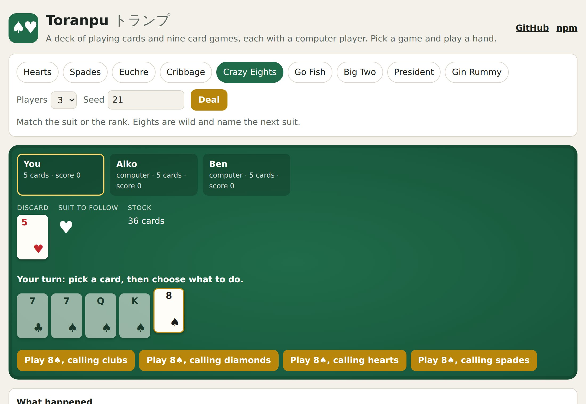

<h1 align="center">Toranpu <sub>トランプ</sub></h1>

<p align="center"><strong>A deck of playing cards and nine card games, each with a computer player.</strong><br>
Hearts, Spades, Euchre, Cribbage, Crazy Eights, Go Fish, Big Two, President and Gin Rummy, as pure TypeScript rules you can drop into any table.</p>

<p align="center">
  <a href="https://github.com/johnmorrisdotca/toranpu/actions/workflows/ci.yml"></a>
  <a href="https://www.npmjs.com/package/@johnmorrisdotca/toranpu"></a>
  <a href="./LICENSE"></a>
  
  
</p>

<p align="center"><a href="https://johnmorrisdotca.github.io/toranpu/"><strong>Play a hand against the computer →</strong></a></p>

<p align="center">
  
  
</p>

*Toranpu* is the everyday Japanese word for a deck of playing cards, from the
English "trump". The games began at the card tables of
[Itsutsu](https://itsutsu.com), a site for board and card games, which plays
them through this package.

## Features

- **Nine games, complete.** Every rule a table argues about is in: Hearts' pass
  and shooting the moon, Spades' nil and bags, Euchre's bowers and stick the
  dealer, Cribbage's pegging and the show, Gin Rummy's layoffs and undercuts,
  President's card swaps, Big Two's five-card hands.
- **A computer for every seat.** Each game has its own player, which sees only
  what its seat could see: its hand, the table and everything said aloud. It
  never peeks, and the tests hold it to that.
- **One interface for all of them.** Every game answers the same questions
  (`moves`, `play`, `toPlay`, `computer`, `over`, `winners`), so one table, one
  bot runner or one test harness plays any of them.
- **Seeded deals.** A game is its seed and its moves. The same seed deals the
  same cards on every device, for ever, so a deal can be shared, replayed or
  used in a test.
- **Saved games as text.** `encode` writes the table, the seed and the moves,
  never a hand; `decode` plays them through the rules again, so a tampered save
  is refused rather than trusted.
- **Pure and immutable.** Plain data in, new plain data out. No classes, no
  mutation, no timers, no DOM, no dependencies. It runs in a browser, a worker,
  Node, Deno or a serverless function.
- **The deck on its own.** Fifty-two card objects, a seeded shuffle, dealing,
  one-character codes (a whole deck is a 52-letter string) and card names, for
  a game of your own.
- **An optional React hook**, `useCardGame`, that holds a game in state and
  lets the computers take their turns.

## Install

```sh
pnpm add @johnmorrisdotca/toranpu
```

ES modules with TypeScript types. No dependencies; the React hook needs React
18 or later.

## Quick start

### Play a whole game

```ts
import { newGame, playComputers, rulesFor } from "@johnmorrisdotca/toranpu";

const players = ["You", "Aiko", "Ben", "Chloé"];
let game = newGame("hearts", { players, seed: 2026, computers: [false, true, true, true] })!;
const rules = rulesFor("hearts");

// Let the computers move until it is your turn.
game = playComputers("hearts", game).game;

// Your moves, as plain data: { pass: ["QS", "AH", "KH"] }, then { play: "2C" } …
const offered = rules.moves(game);
game = rules.play(game, offered[0])!;

if (rules.over(game)) console.log("won by", rules.winners(game).map((seat) => players[seat]));
```

### Save and restore

```ts
const text = rules.encode(game);     // {"v":1,"g":"hearts","size":100,…,"seed":2026,"moves":[…]}
const back = rules.decode(text);     // the same game, or null if the text is not a game
```

### In React

```tsx
import { useCardGame } from "@johnmorrisdotca/toranpu/react";

export function CrazyEights() {
  const table = useCardGame("crazyEights", { players: ["You", "Ann", "Ben"], computers: [false, true, true] });
  if (!table.game) return null;
  return (
    <>
      <p>{table.over ? "Game over" : table.computerToPlay ? "Thinking…" : "Your turn"}</p>
      {table.moves.map((move) => (
        <button key={JSON.stringify(move)} onClick={() => table.play(move)}>{JSON.stringify(move)}</button>
      ))}
    </>
  );
}
```

### Just the deck

```ts
import { shuffledDeck, dealRound, cardName, writeCards } from "@johnmorrisdotca/toranpu/deck";

const deck = shuffledDeck(42);                  // [{ suit: "clubs", rank: 7 }, …]
const { hands, rest } = dealRound(deck, 4, 5);  // four hands of five
cardName(hands[0][0]);                          // "seven of clubs"
writeCards(deck);                               // a 52-letter string, one letter a card
```

## The games

| Game | Players | `size` (how long a game lasts) | The computer |
| --- | --- | --- | --- |
| **Hearts** | 3–4 | 50 or 100: the score that ends it, lowest wins | Passes the queen of spades and the cards that catch her, ducks tricks, dumps the queen as soon as it is safe |
| **Spades** | 4, partners | 200, 300 or 500 to win | Bids what its hand is worth, nil only on a hand of nothing, ducks bags once the contract is made, covers its partner's nil |
| **Euchre** | 4, partners | 5 or 10 to win | Weighs the bowers, trump honours and outside aces before making trump, leads trump when its side made it |
| **Cribbage** | 2 | 61 or 121 to win | Keeps the four worth most over every possible starter, counting its throw for or against its crib; pegs for points and never leads a five |
| **Crazy Eights** | 2–7 | 50, 100 or 200 to win | Saves its eights, stays in its longest suit, sheds its points |
| **Go Fish** | 2–6 | 1: a single deal | Remembers everything asked and answered, and asks whoever it knows holds the rank |
| **Big Two** | 2–4 | 1, 3 or 5 deals, fewest points wins | Sheds low cards first, beats cheaply without breaking up pairs, holds its aces and twos for the end |
| **President** | 3–8 | 3, 5 or 7 rounds, most points wins | Hands back its lowest cards, leads low, keeps its twos and aces back |
| **Gin Rummy** | 2 | 50, 100 or 150 to win | Takes the discard only into a meld, throws the card that leaves least deadwood, never feeds the other player's melds, knocks as soon as it may |

Cards are two-letter ids in play: rank `A 2 3 4 5 6 7 8 9 T J Q K`, then suit
`S H D C`. `"QS"` is the queen of spades and `"TD"` the ten of diamonds.

Moves are small objects, one shape per kind of action:

| Game | Moves |
| --- | --- |
| Hearts | `{ pass: [a, b, c] }`, `{ play: card }` |
| Spades | `{ bid: n }` (0 is nil), `{ play: card }` |
| Euchre | `{ order: true }`, `{ pass: true }`, `{ call: suit }`, `{ discard: card }`, `{ play: card }` |
| Cribbage | `{ crib: [a, b] }`, `{ play: card }` |
| Crazy Eights | `{ play: card, suit? }` (the suit an eight calls), `{ draw: true }`, `{ pass: true }` |
| Go Fish | `{ ask: seat, rank }` |
| Big Two | `{ play: cards }`, `{ pass: true }` |
| President | `{ give: cards }`, `{ play: cards }`, `{ pass: true }` |
| Gin Rummy | `{ draw: "stock" }`, `{ draw: "discard" }`, `{ discard: card }`, `{ knock: card }` |

`rules.moves(game)` always lists every move the player to move may make, so a
table never needs to know the rules to offer them.

## API

Everything is typed; your editor shows each function's full documentation.

### `@johnmorrisdotca/toranpu`

| Export | What it does |
| --- | --- |
| `newGame(kind, { players, size?, seed?, computers? })` | A new game, or `null` for a table the game is not offered for |
| `rulesFor(kind)` | That game's `CardGameRules`, typed with its own game and move |
| `playComputers(kind, game)` | Plays every computer move due; returns `{ game, moves }` |
| `randomSeed()` | A fresh seed, 1 to 2³¹ − 1 |
| `CARD_GAME_RULES` | Every game's rules, by kind |
| `CARD_GAME_TABLES` | Every game's table: fewest, most and usual players, the sizes offered and the usual one |
| `CARD_GAME_LIST`, `CARD_GAME_KINDS` | The nine kinds |
| `hearts`, `spades`, `euchre`, `cribbage`, `crazyEights`, `goFish`, `bigTwo`, `president`, `ginRummy` | Each game's own exports, as a namespace |
| `cardGameCodec(name, start, play, isMove)` | The save format, for a game of your own |
| Card ids: `FULL_DECK`, `isCard`, `rankOf`, `suitOf`, `cardOf`, `cardWords`, `rankWords`, `suitWords` | Reading and naming `"QS"`-style cards |
| Dealing: `shuffledDeck(seed, deal)`, `reshuffled`, `mixSeed`, `dealRound`, `without`, `choices`, `nextSeat` | What every game does before its own rules begin |
| `seededRandom(seed)`, `shuffled(list, random)` | The seeded stream every deal comes from |

Every game's rules have this shape:

```ts
type CardGameRules<Game, Move> = {
  start(size: number, players: readonly string[], _reserved?: unknown, seed?: number, computers?: readonly boolean[]): Game | null;
  moves(game: Game): readonly Move[];          // every move the player to move may make
  play(game: Game, move: Move): Game | null;   // the next game, or null for a move the rules refuse
  toPlay(game: Game): number | null;           // the seat to move; null once it is over
  computer(game: Game): Move;                  // what a computer in that seat plays
  over(game: Game): boolean;
  winners(game: Game): readonly number[];      // seats; two for a winning partnership
  seats(game: Game): { players: readonly string[]; computers: readonly boolean[] };
  encode(game: Game): string;
  decode(text: string | null): Game | null;
  sensible?(game: Game, random: () => number): Move;  // a random move that still ends the game, for simulations
};
```

### `@johnmorrisdotca/toranpu/<game>`

Each game is also its own entry point, so a table that plays one game loads
one game. They follow one naming pattern (shown for Hearts):

| Export | What it does |
| --- | --- |
| `startHearts`, `playHearts`, `heartsMoves`, `heartsWinners` | The rules as plain functions |
| `heartsComputer(game)`, `heartsView(game)` | The computer's move, and the part of the game its seat can see |
| `encodeHearts`, `decodeHearts` | The save format |
| `HEARTS_RULES` | All of the above as one `CardGameRules` |
| `HeartsGame`, `HeartsMove`, … | The game's types |
| Game helpers | Scoring and ordering: `heartsPoints`, `trickWinner`, `spadesTrickWinner`, `euchreHeight`, `showCount` (Cribbage), `bestLayout` and `deadwoodOf` (Gin), `bigTwoBeats`, `presidentTitle` and more |

Entry points: `hearts`, `spades`, `euchre`, `cribbage`, `crazyEights`,
`goFish`, `bigTwo`, `president`, `ginRummy`.

### `@johnmorrisdotca/toranpu/deck`

| Export | What it does |
| --- | --- |
| `freshDeck()`, `shuffledDeck(seed)` | Fifty-two `{ suit, rank }` cards, sorted or shuffled from a seed |
| `dealRound(deck, hands, each)`, `dealAll(deck, hands)`, `take(deck, n)` | Dealing, one card at a time round the table |
| `cardCode`, `cardFromCode`, `writeCards`, `readCards`, `isWholeDeck` | One character a card: a deck as a 52-letter string, safe in an address |
| `cardId`, `cardFromId` | The two-letter ids the games use |
| `cardName`, `cardShortName`, `colourOf`, `isRed`, `sortedHand` | Naming, colour and sorting |
| `SUITS`, `RANKS`, `SUIT_DISPLAY`, `RANK_DISPLAY`, `CARD_ALPHABET` | The vocabulary |

### `@johnmorrisdotca/toranpu/react`

`useCardGame(kind, options, computerDelay = 700)` returns
`{ game, toPlay, computerToPlay, moves, over, winners, play, restart }`.
Computers move by themselves, one move every `computerDelay` milliseconds.

## Browser support

Any browser with ES2020 modules: Chrome, Edge, Firefox and Safari from 2020 on,
and Node 20 or later. Nothing is polyfilled because nothing needs to be.

## Roadmap

- Solitaire: Klondike, FreeCell and Spider with a solver and winnable deals.
- Oh Hell and Rummy 500.
- A choice of computer strength for each game.
- A framework-free card table component to go with the React hook.

Ideas and requests are welcome in the
[issues](https://github.com/johnmorrisdotca/toranpu/issues).

## Contributing

See [CONTRIBUTING.md](./CONTRIBUTING.md). In short: `pnpm install`,
`pnpm check`, and a test for any rule you change. Everyone taking part follows
the [code of conduct](./CODE_OF_CONDUCT.md).

## Licence

[MIT](./LICENSE) © John Morris
